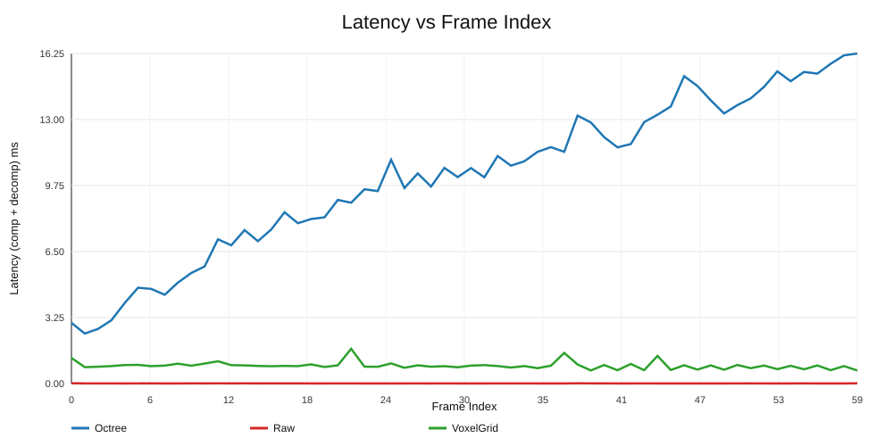

# ROS Bag Point Cloud Compression Pipeline

This project reads a ROS `.bag` file that contains laser scan data, converts each scan message into a PCL point cloud, compares three compression methods (Raw, Octree, and VoxelGrid), writes outputs to disk, reconstructs clouds, visualizes results, and runs a k-d tree spatial query.

The current input file in this workspace is:

- `b3-2015-12-10-12-41-07.bag`

## Overall Pipeline

```text
ROS bag (.bag)
  -> ROS bag record reader
  -> rosbag chunk decompression (none/bz2/lz4)
  -> scan message extraction
  -> scan-to-point-cloud conversion
  -> three-method compression benchmark
  -> binary storage (.bin)
  -> cloud reconstruction
  -> visualization
  -> k-d tree query
  -> performance metrics
```

## Project Structure

```text
ros-pointcloud-compression-pipeline/
|-- b3-2015-12-10-12-41-07.bag         # Input ROS bag
|-- cloud_frames.bin                   # Generated compressed binary output
|-- CMakeLists.txt                     # Build target and dependency wiring
|-- CMakePresets.json                  # Preset-based CMake configuration
|-- vcpkg.json                         # Package manifest for dependencies
|-- README.md                          # Project documentation
|-- include/
|   `-- BagPointCloudPipeline.h        # Pipeline config, metrics, and class interface
`-- src/
    |-- bag_pipeline_main.cpp          # CLI entry point and argument parsing
    `-- BagPointCloudPipeline.cpp      # ROS bag parsing, conversion, compression, metrics, visualization
```

## Main Components

### 1. `PipelineConfig`

`PipelineConfig` stores the runtime settings used by the program:

- input bag path
- output binary path
- maximum number of frames to process
- k-d tree search radius

This keeps the pipeline configurable without changing source code every time you want to test different runs.

### 2. `FrameMetrics`

`FrameMetrics` stores the result for a single frame:

- frame index
- number of points
- raw point cloud size in bytes
- compressed size in bytes
- capture-to-cloud latency
- compression latency
- decompression latency

This is the per-frame measurement layer of the project.

### 3. `PipelineSummary`

`PipelineSummary` stores accumulated totals and averages across all processed frames:

- number of frames processed
- total raw size
- total compressed size
- average capture-to-cloud time
- average compression time
- average decompression time

This gives you the experiment-level summary instead of only individual frame logs.

### 4. `BagPointCloudPipeline`

This is the main application class. It is responsible for:

- reading the ROS bag
- decoding rosbag chunks compressed with none/bz2/lz4
- extracting laser scan messages
- converting scans into `pcl::PointCloud<pcl::PointXYZ>`
- compressing and decompressing point clouds
- writing compressed blobs into `cloud_frames.bin`
- running visualization
- running k-d tree neighborhood search
- printing summary metrics

## What a Frame Means in This Project

In this project, a frame is one extracted scan sample converted into one point cloud.

Because this bag is not a RealSense depth recording, a frame here does not mean a camera depth image. Instead:

- the bag contains laser scan messages
- one scan message is interpreted as one frame
- one frame becomes one 2D or pseudo-3D point cloud depending on the scan topic
- that one cloud is then compressed, stored, decompressed, and analyzed

So the processing loop is effectively:

1. read one scan message
2. convert it into a point cloud
3. measure raw cloud size
4. compress the cloud
5. measure compressed size
6. decompress the cloud
7. visualize the decoded result
8. run spatial query on the decoded result
9. record timings and statistics

### Horizontal and Vertical Frames

The bag appears to contain scan topics such as:

- `horizontal_laser_2d`
- `vertical_laser_2d`
- `imu`

The current project mainly uses the laser scan messages.

The idea is:

- horizontal scans are projected onto the `x-y` plane
- vertical scans are projected onto the `x-z` plane
- each scan becomes a cloud of `pcl::PointXYZ` points

This gives you a simple geometric representation that can still be compressed and queried with PCL tools.

## Why This Project Is Useful

### 1. It turns raw robotics data into a usable geometric representation

ROS bag files are useful for logging, but they are not directly convenient for many geometry-processing tasks. This project converts recorded scan data into PCL point clouds, which makes the data much easier to analyze and visualize.

### 2. It demonstrates compression for point cloud storage and transmission

Point clouds can become large very quickly. Octree compression reduces the storage cost of each frame while preserving enough structure for later analysis.

This is useful when you want to:

- archive scan sequences
- reduce disk usage
- prepare data for streaming or network transfer
- compare raw versus compressed storage cost

### 3. It provides measurable performance results

This project is not only a converter. It also measures how expensive each stage is.

That means you can study:

- how long it takes to prepare a cloud from a frame
- how expensive compression is
- how expensive decompression is
- how well the chosen compression settings reduce size

This is important for real-time systems, robotics pipelines, and storage experiments.

### 4. It keeps the full round trip

The project does not stop at compression. It also decompresses the cloud immediately and uses the decoded result for visualization and spatial search.

That is important because it helps answer a practical question:

- after compression and decompression, is the cloud still useful for downstream tasks?

### 5. It connects storage with analysis

A lot of sample projects stop after saving data. This project continues into spatial analysis through a k-d tree search.

That means you can check whether the decoded point cloud is still useful for:

- neighbor search
- local geometry analysis
- proximity queries
- future clustering or segmentation work

### 6. It is a good base for future robotics and 3D perception work

This project can be extended later into:

- scan registration
- mapping
- obstacle analysis
- multi-frame fusion
- trajectory-linked scan processing
- feature extraction
- surface reconstruction

## Metrics Reported by the Program

The program is designed to report these key results.

### Compression Ratio

The compression ratio is computed as:

$$
\text{compression ratio} = \frac{\text{raw size}}{\text{compressed size}}
$$

If the ratio is larger than `1`, the compressed form is smaller than the original raw cloud representation.

### Per-Frame Latency

Each processed frame reports timing for:

- capture to cloud
- compression
- decompression

In the current ROS bag version, `capture to cloud` means the time to take an extracted scan frame and represent it as a PCL cloud ready for the compression step.

### Average Latency

After all frames are processed, the project computes average timing values across the run.

This helps compare different settings such as:

- different `max-frames` values
- different octree settings
- different bag files
- different scan densities

## Build

### Prerequisites

- Visual Studio Build Tools (MSVC)
- CMake 3.20+
- Ninja
- vcpkg with `VCPKG_ROOT` environment variable set

Run configure/build from **Developer PowerShell for Visual Studio** (or VS Code CMake Tools with an MSVC kit) so `cl` is available on `PATH`.

Example (PowerShell):

```powershell
$env:VCPKG_ROOT = "C:/path/to/vcpkg"
```

```powershell
cmake --preset msvc-vcpkg-debug
cmake --build --preset build-debug
```

## Run

```powershell
.\build\msvc-vcpkg-debug\BagPointCloudPipeline.exe --bag b3-2015-12-10-12-41-07.bag --out cloud_frames.bin --max-frames 60 --radius 1
```

## Why This Stands Out

- Designed and implemented a full ROS bag to analytics pipeline instead of a single isolated algorithm.
- Benchmarked three methods on identical data and presented measurable tradeoffs in size and latency.
- Included practical outputs (CSV + SVG plots) to support reproducible decision-making.
- Structured the codebase for extension into production robotics tasks (mapping, registration, and spatial analysis).

## Command Line Arguments

- `--bag <path>`: path to the input ROS bag file
- `--out <path>`: path to the output binary file containing compressed frame blobs
- `--max-frames <n>`: maximum number of scan frames to process
- `--radius <meters>`: radius used for k-d tree neighbor search

## Output Files

### `cloud_frames.bin`

This file stores compressed frame payloads written by the pipeline.

Each stored record includes:

- frame index
- compressed payload size
- compressed payload bytes

This makes it possible to persist the compressed output of the experiment for later reuse.

## Three-Method Comparison (Raw vs Octree vs VoxelGrid)

I compared three compression strategies on the same bag run (60 frames):

- Raw baseline serialization
- PCL Octree compression
- VoxelGrid downsampling + serialization

### Comparison Summary

| Method | Frames | Total Size (MB) | Compression Ratio (raw/compressed) | Avg Compression (ms) | Avg Decompression (ms) |
|---|---:|---:|---:|---:|---:|
| Raw | 60 | 0.351562 | 1.000000 | 0.002453 | 0.005902 |
| Octree | 60 | 0.276909 | 1.269596 | 3.099453 | 7.479068 |
| VoxelGrid | 60 | 0.108658 | 3.235501 | 0.878068 | 0.006122 |

### Comparison Summary Screenshot



### Conclusion

This experiment shows a practical engineering tradeoff rather than a one-size-fits-all answer:

- VoxelGrid delivered the strongest size reduction (3.24x), making it the best choice when storage and transport efficiency are the top priority.
- Octree provided moderate compression (1.27x) but with higher encode/decode cost, which can be justified when preserving richer geometric fidelity is more important than throughput.
- Raw stayed fastest but gave no compression benefit, so it is best used as a baseline or for low-latency debug pipelines.

From a hiring-manager perspective, this project demonstrates production-minded thinking: I built an end-to-end pipeline, instrumented it with measurable KPIs, compared alternatives on identical data, and made evidence-based design recommendations instead of relying on assumptions.

## Summary

This project is a compact end-to-end example of:

- reading a ROS bag
- extracting scan frames
- generating PCL point clouds
- compressing and storing them
- restoring them again
- visualizing the result
- querying the result spatially
- measuring performance

It is useful both as a learning project and as a starting point for larger robotics perception experiments.
